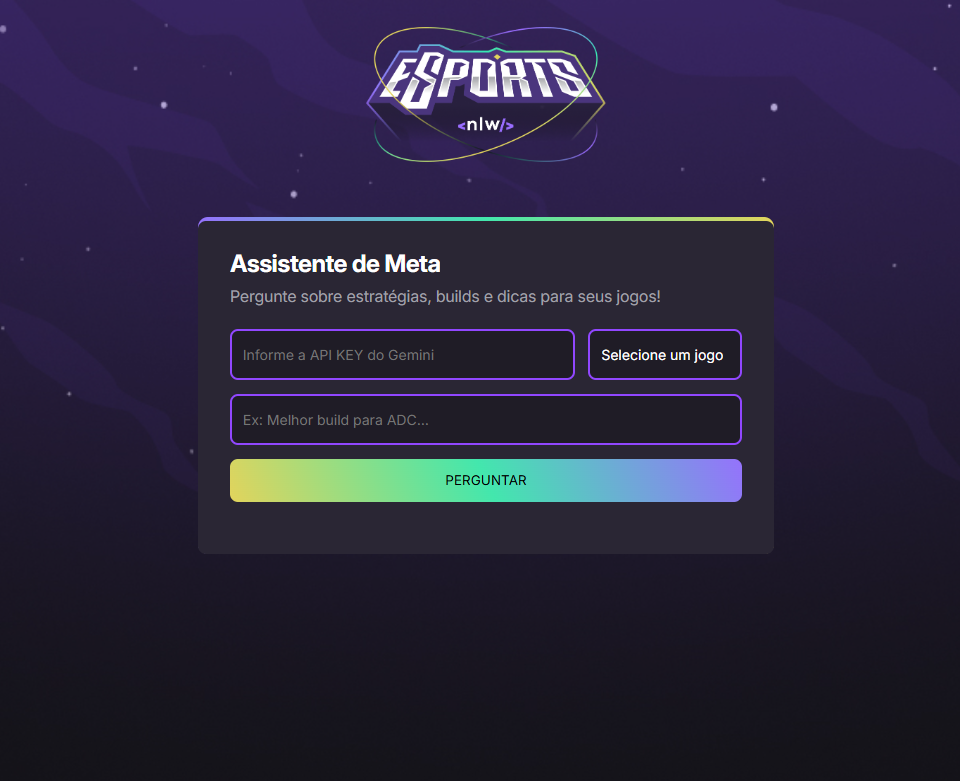
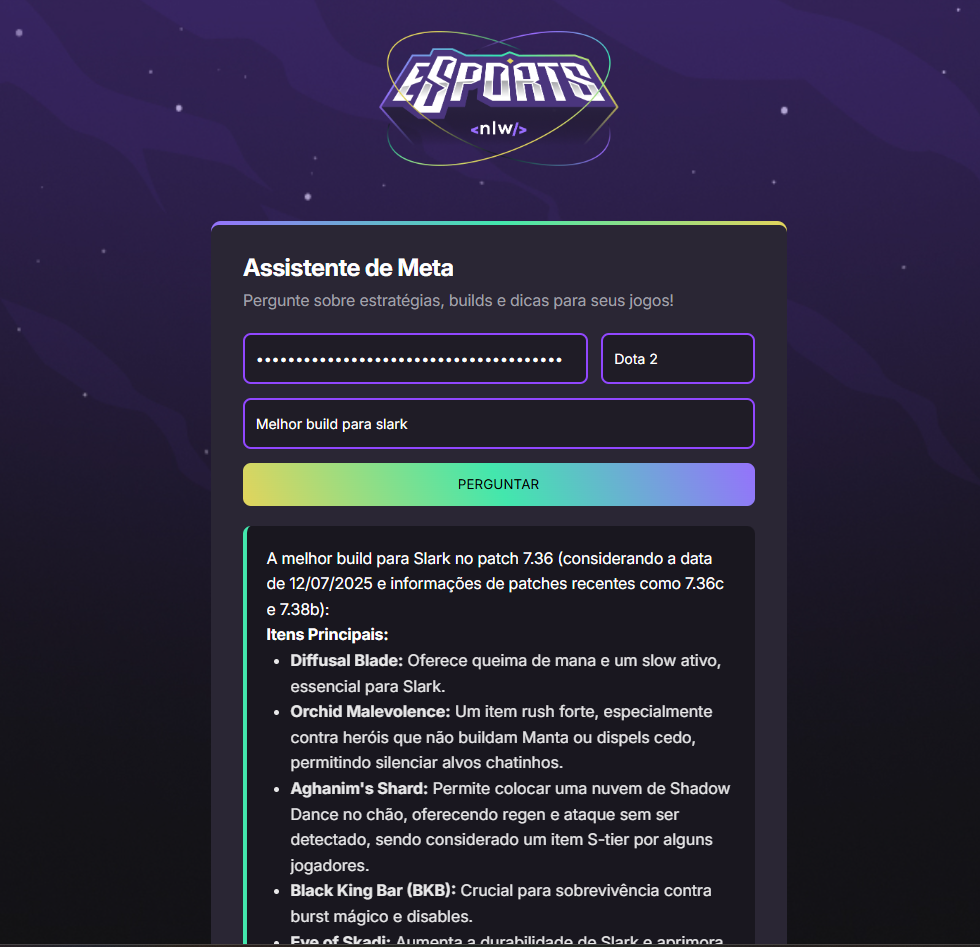

Developed by Taylor Vinícius

```markdown
# Gamer Assistant with Gemini AI

A virtual gaming assistant built with HTML, CSS, and JavaScript, powered by **Gemini**, a Google AI model. This assistant delivers custom tips, builds, and strategies for a variety of games.

## 🎮 Features

- Responsive and user-friendly interface
- AI-powered smart responses
- Game build suggestions and tactical strategies
- Personalized tips based on your gameplay style

## 🛠️ Technologies Used

- **HTML5** — Structure
- **CSS3** — Styling and responsiveness
- **JavaScript (ES6+)** — App logic and interactions
- **Gemini (Google AI)** — Natural language understanding
```





```markdown
## 🧠 About the Project

- This project was created as part of my learning journey in web development and AI integration. It combines interactive UI with the power of artificial intelligence to assist gamers with real-time insights.

## 📌 Project Status

✅ Completed (initial version)

## 🤝 Contributions

Feel free to open issues or submit pull requests. Any kind of contribution is appreciated!
```
